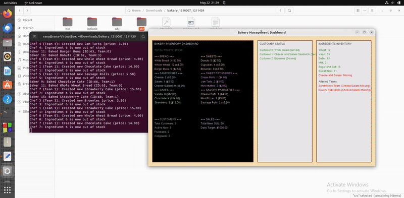

# 🍞 Bakery Management Simulation System 🧁



## 📚 Table of Contents
1. [🎯 Project Overview](#project-overview)
2. [🏗️ System Architecture](#system-architecture)
3. [📁 File Structure](#file-structure)
4. [🔍 Detailed File Descriptions](#detailed-file-descriptions)
5. [🛠️ Build and Execution](#build-and-execution)

---

## 🎯 Project Overview

A comprehensive 🍩 **bakery operation simulator** demonstrating:

- 🔄 Multi-process synchronization using POSIX semaphores  
- 🧠 Shared memory management  
- 🚦 Semaphore-based coordination  
- 🖥️ Real-time OpenGL visualization  
- ⚙️ Dynamic resource allocation  

---

## 🏗️ System Architecture

```
[👩‍🍳 Chefs] → [🧑‍🍳 Bakers] → [🥖 Unbaked Items]
       ↑           ↑
       [📋 Manager] [🚚 Supply Chain]
                       ↓
                    [📊 Visualization]
                       ↑
[🧍 Customers] → [🧑‍💼 Sellers] → [🍰 Ready Items]
```

---

## 📁 File Structure

```
bakery_simulation/
├── bin/                # 📦 Compiled executable
├── include/            # 📘 Header files
│   ├── bakery.h             # 🧩 Main data structures
│   ├── shared_memory.h      # 🔗 IPC functions
│   └── visualization.h      # 🖼️ GUI definitions
├── src/                # 💻 Source code
│   ├── baker.c              # 🍞 Baking process
│   ├── chef.c               # 🍳 Food preparation
│   ├── customer.c           # 🛍️ Customer behavior
│   ├── main.c               # 🚀 Entry point
│   ├── manager.c            # 🧠 System oversight
│   ├── seller.c             # 💰 Sales handling
│   ├── shared_memory.c      # 🧬 Memory management
│   ├── supply_chain.c       # 🚚 Inventory restocking
│   └── visualization.c      # 📊 Real-time dashboard
├── Makefile            # 🛠️ Build configuration
├── variables.txt       # ⚙️ Runtime parameters
└── README.md           # 📄 Documentation
```

---

## 🔍 Detailed File Descriptions

### 🍞 Core Components

**`src/main.c`**  
- 🚀 Initializes shared memory segments  
- 👷 Spawns all worker processes  
- 🌀 Manages simulation lifecycle  

**`src/chef.c`**  
- 🥣 Creates unbaked items  
- 🧂 Manages ingredient consumption  
- 🧑‍🤝‍🧑 Team-based production logic  

**`src/baker.c`**  
- 🔥 Processes unbaked items  
- 📝 Implements baking queue  
- ✅ Quality control checks  

---

### 🧰 Support Systems

**`src/manager.c`**  
- 📊 Monitors KPIs (frustration, profit)  
- 🔄 Rebalances teams dynamically  
- ⏹️ Enforces termination conditions  

**`src/visualization.c`**  
- 🖼️ Renders 3 dashboard panels:  
  1. 📦 Inventory status  
  2. 👥 Customer states  
  3. 🌽 Ingredient levels  
- 🎨 Uses OpenGL for real-time updates  

---

## 🛠️ Build and Execution

Time to bake some code! 👩‍🍳🔥

### 🧹 Clean & Bake

```bash
make clean && make
```

- 🔁 Cleans previous builds  
- 🏗️ Compiles all components  

### 🎬 Run the Simulation

```bash
make run
```

- 🍰 Launches the simulation  
- 🖥️ Watch the bakery in action with OpenGL!

---

### 🧾 Requirements

Before starting, make sure your oven is set up! 🔧

```bash
sudo apt-get install build-essential freeglut3-dev
```

- 🧰 `build-essential` – for compiling the project  
- 🖼️ `freeglut3-dev` – for the OpenGL dashboard  

---

Happy Baking! 🍪✨  
Let the semaphores rise and the pastries shine! 🎂💻
